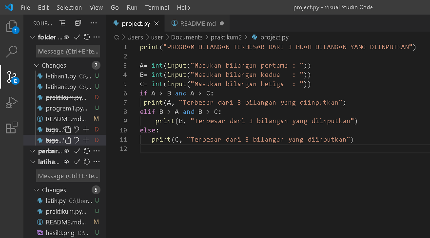
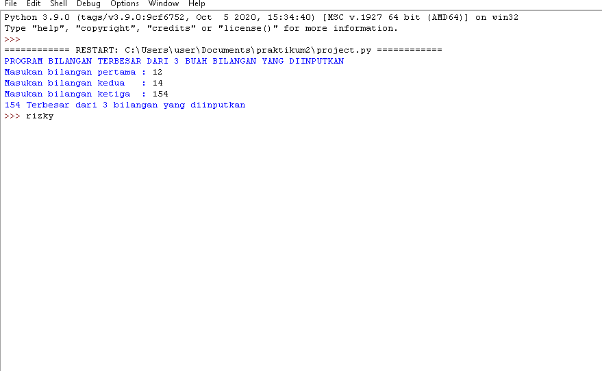

# labspy02
## Tugas Melengkapi Praktikum 2
| Nama | kelas | Nim | Matkul |
| -- | --- | ---- | ----------- |
| Muhammad Rizky Abdillah | TI.A2.20 | 312010386 | Bahasa Pemrograman |

## langkah membuat program sederhana menampilkan bilangan terbesar dari 3 buah bilangan menggunakan statement if

pada  perintah kondisional hanya ada 2 kondisi, yaitu jika a bernilai genap atau ganjil.kenyataannya akan sering
ditemukan program yang memerlukan seleksi lebih dari 2 kondisi.contoh kasus yang membutuhkan seleksi lebih dari 2 
kondisi adalah:

-membuat program menentukan nilai akhir

-membuat program penampilkan status gaji karyawan

-penggunaan kondisi OR program membandingkan 3 input bilangan,apabila penjumlahan 2 bilangan hasilnya
 sama dengan bilangan lainnya,maka cetak pernyataan "benar"

untuk kasus  dengan banyak kondisi,if tetap dapat digunakan dengan menggunakan if bersarang (nasted if).sebagai
contoh saya akan membuat program sederhana menampilkan bilangan terbesar dari 3 buah bilangan.

A.untuk mencari bilangan terbesar dari 3 bilangan algoritmanya yang dimasukkan akan membandingkan terlebih dahulu
 apakah a>b.


B.jika a>b,maka ada 2  kadidat bilangan terbesar,yaitu a dan c sehingga perlu dilakukan pengujian yang manakah
 dari a dan c yang lebih besar dengan melakukan membandingkan nilai b dan c. jika nilai b ternyata lebih besar dari c,
 maka bilangan terbesar adalah a.nilai terbesar adalah c jika ternyata c lebih besar dari dari a.

C.jika kondisi a>b tidak terpenuhui(atau b<=a),maka 2 kadidat bilangan terbesar  adalah b dan c.jika nilai c ternyata 
 lebih kecil dari a,maka b adalah nilai terbesar,sedangakan jika c yang lebih besar dari b,maka yang terbesar adalah c.

perhatikan hasil dari flowchart berikut ini :


perhatikan struktur algoritma dengan psuedocode berikut ini:


1.strat

2.gunakaan inisial a,b,c sebagai intenjer.


3.read a

4.read b

5.read c

6.if a>b and a<c:

7.cetak "a terbesar dari bilangan yang diinputkan"


8.elif b>a and b>c:

9.cetak "b terbesar dari bilangan yang diinputkan"

10.else

11.cetak "c terbesar dari bilangan yang diiinputkan"


12.cetak " nilai terbesar yang diinputkan"

13.stop

proyek:



output yang ditampillkan:



ini adalah hasil source code nya

```python
#rizkyz
print("PROGRAM BILANGAN TERBESAR DARI 3 BUAH BILANGAN YANG DIINPUTKAN")

A= int(input("Masukan bilangan pertama : "))
B= int(input("Masukan bilangan kedua   : "))
C= int(input("Masukan bilangan ketiga  : "))
if A > B and A > C:
 print(A, "Terbesar dari 3 bilangan yang diinputkan")
elif B > A and B > C:
    print(B, "Terbesar dari 3 bilangan yang diinputkan")
else:
   print(C, "Terbesar dari 3 bilangan yang diinputkan")

```
